# Ros 2 Pycharm Intellisense Fix
Solution for libraries import unresolved reference error in Pycharm with Ros 2 with/without Docker:

## Table of contents
* [Problem](#problem)
* [Solution](#solution)
  * [Add Python interpreter from Docker](#add-python-interpreter-from-docker)
  * [Add Ros 2 libraries](#add-ros-2-libraries)


## Problem

Pycharm Intelisense doesn't see ROS 2 Python libraries

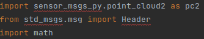


## Solution


### Add Python interpreter from Docker

Click **File** in left top corner near Pycharm logo

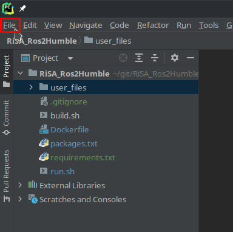

Click **Settings**

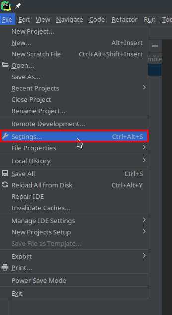

Choose your project

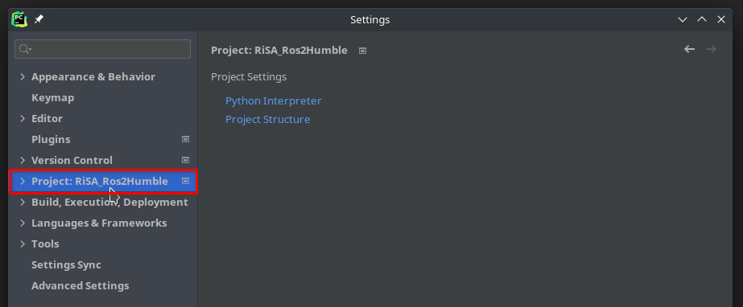

Click **Python interpreter**

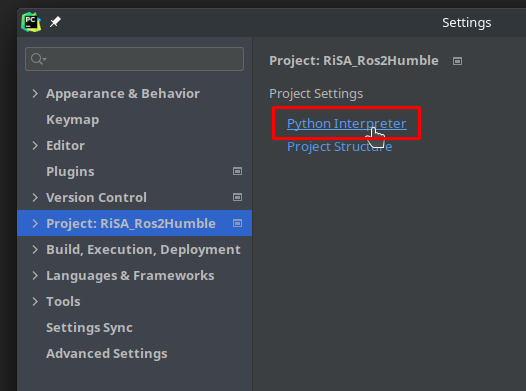

Click on actual Python interpreter

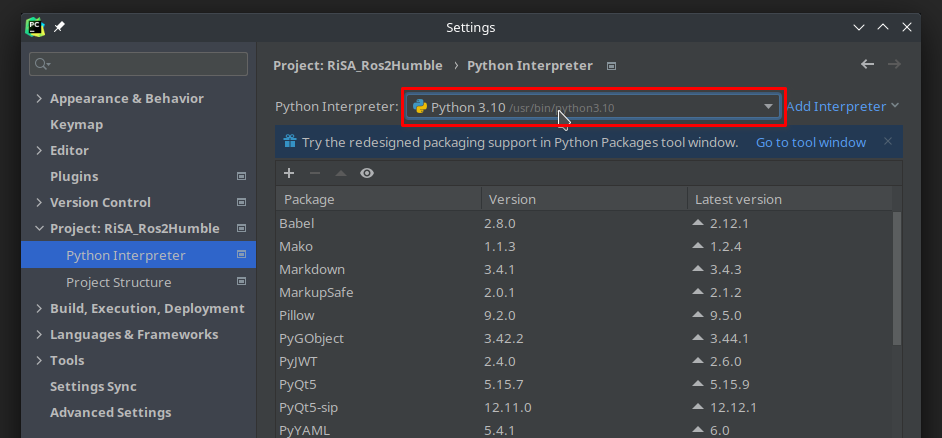

Click on **Show All...**

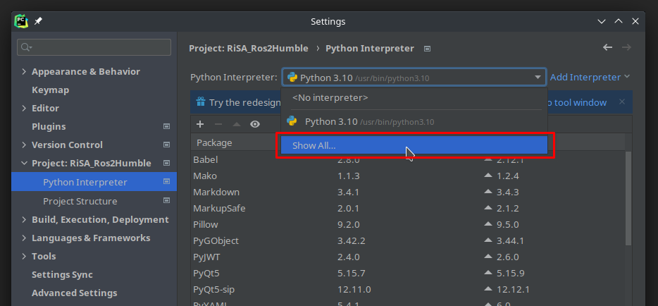

Click on **+** in new window

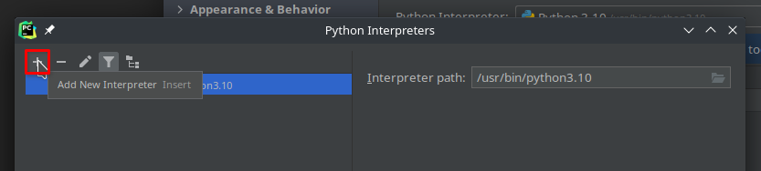

Click **On Docker**

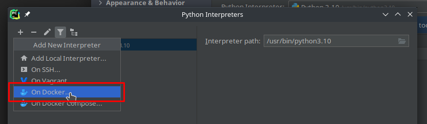

In **Image** options choose **Pull or use existing**

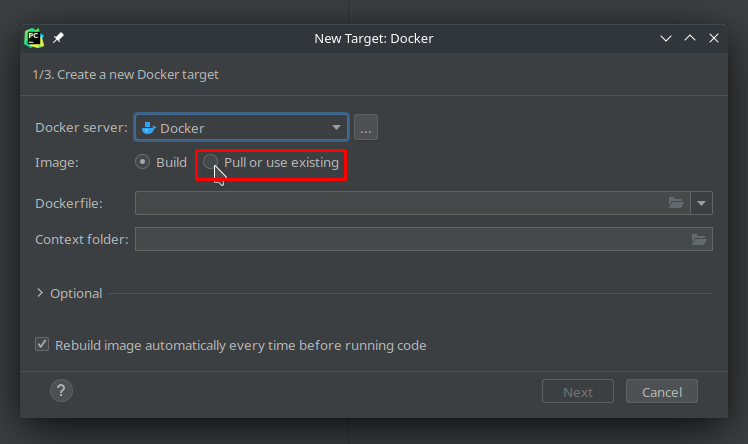

In **Image Tag** write your image name

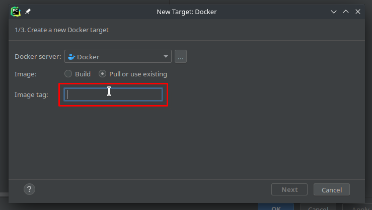

Click <kbd> <br> Next <br> </kbd>

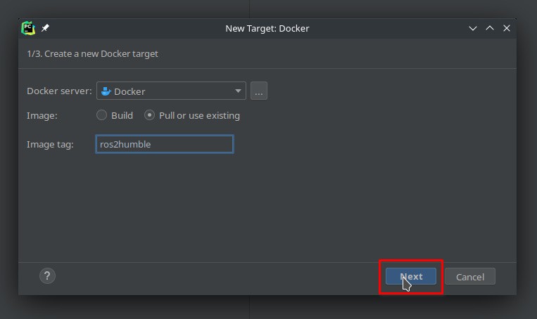

Wait for image pulling and click <kbd> <br> Next <br> </kbd>

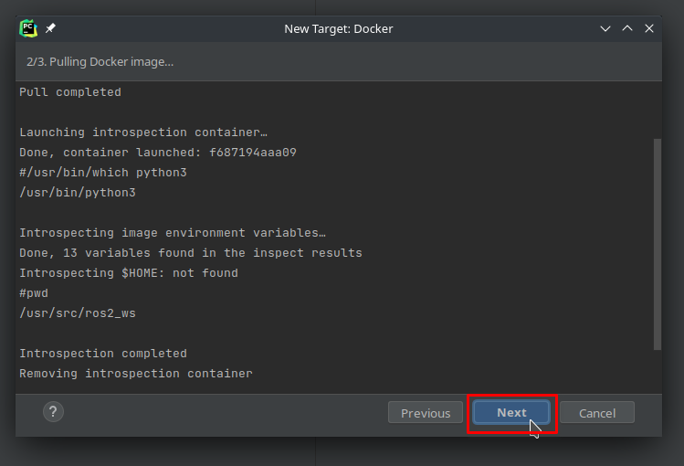

Click <kbd> <br> Create <br> </kbd>

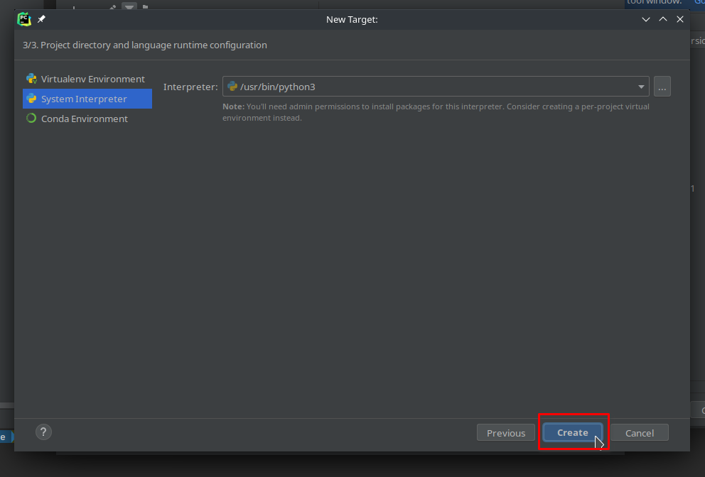

Click <kbd> <br> OK <br> </kbd>

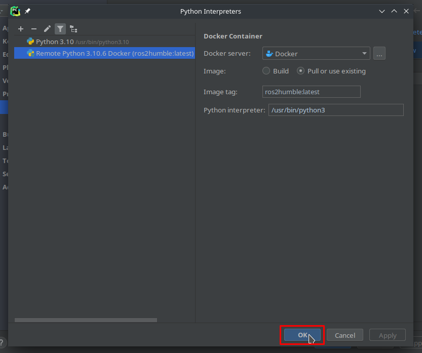


### Add Ros 2 libraries

Click on **Show All...** in Settings

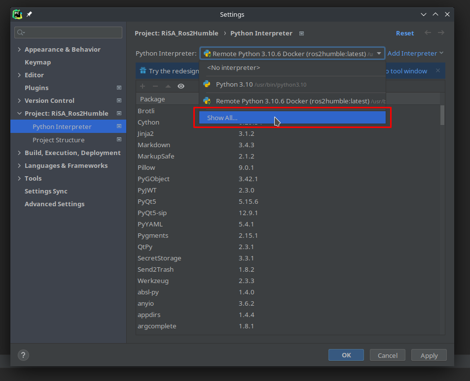

Click on strange folder branch icon near hopper in new window

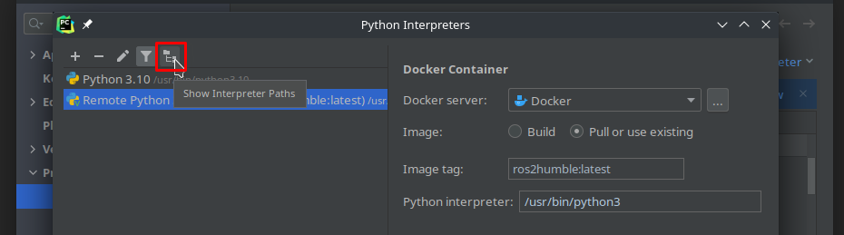

Click **+** in new window for every path (more in next step)

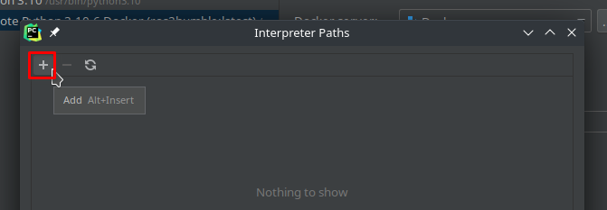

Enter 2 paths in the same way separetly with this template:

```
/opt/ros/<ros-distro>/lib/<python-version>/site-packages/
```

```
/opt/ros/<ros-distro>/local/lib/<python-version>/dist-packages/
```

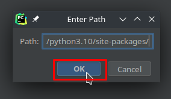

On next screenshot there are examples of paths.

After adding two path separetly click <kbd> <br> OK <br> </kbd>

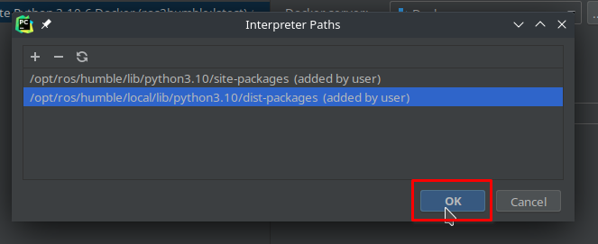

In Python Interpreters click <kbd> <br> Apply <br> </kbd>

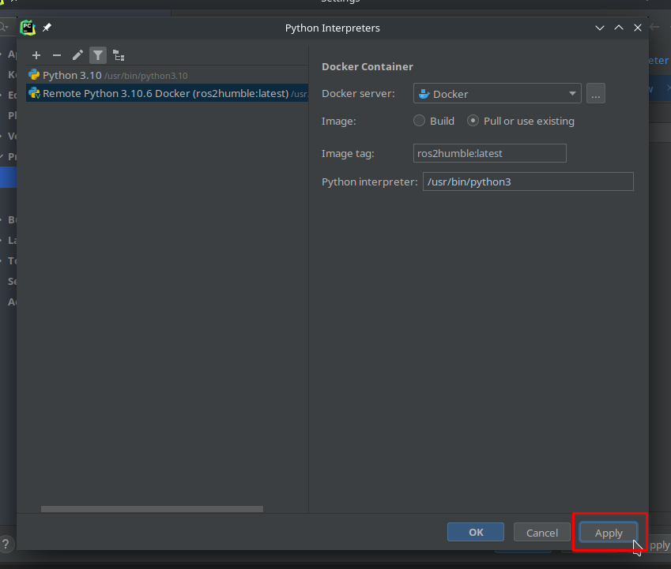

Next click <kbd> <br> OK <br> </kbd>

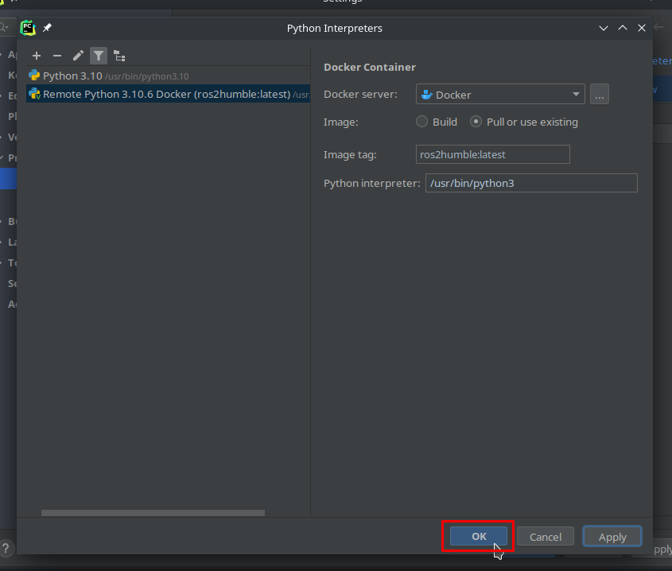

In Settings click <kbd> <br> Apply <br> </kbd>

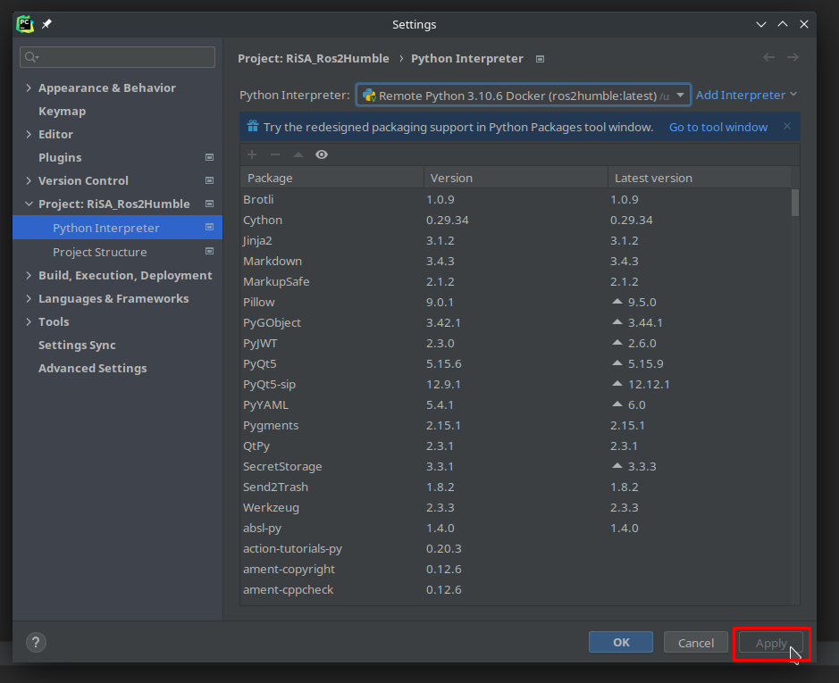

and then click <kbd> <br> OK <br> </kbd>

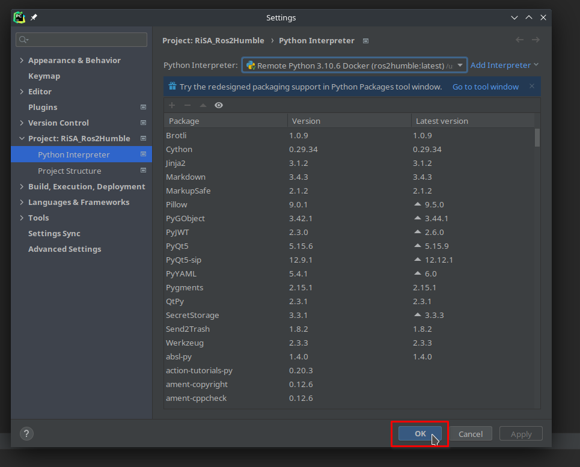

After that you need wait for index (on bottom of the Pycharm)

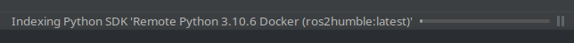
